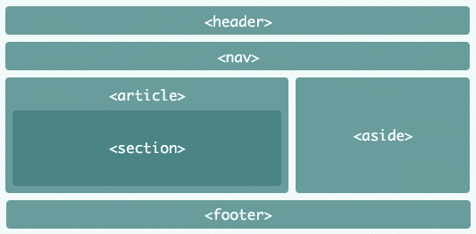

# Estudo para a página index do portifólio.


<p>

## header
**HTML**

```html
<header>
    <h1 class="fL">
        <a href="#" title="Mateus Guimarães Alves">Mateus Guimarães Alves</a>
    </h1>

    <nav class="fR">
        <ul class="l2">
            <li>
                <a href="#formacao" title="formacao">Formação</a>
            </li>
            <li>
                <a href="#curriculos" title="curriculos">Currículos</a>
            </li>
            <li>
                <a href="#projetos" title="projetos">Projetos</a>
            </li>
            <li>
                <a href="#certificados" title="certificados">Certificados</a>
            </li>
</header>
```
**CSS**
```css
header {
  min-height: 60px;
  position: fixed;
  top: 0;
  right: 0;
  left: 0;
  border-bottom: 1px solid #ccc;
  background: #ECECEC;
  z-index: 2;
}
```

